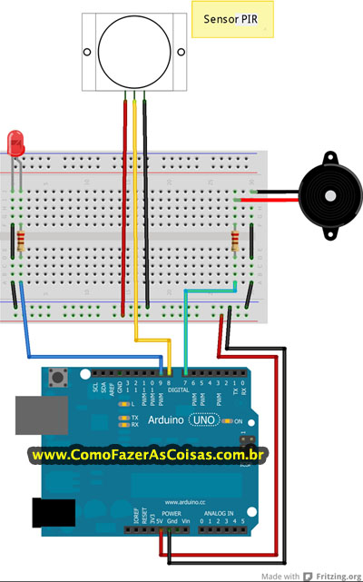

# Projeto Arduino - Alarme com sensor de movimento

# Descrição:
 É um sensor eletrônico com capacitade de medir a luz infravermelha irradiada de objetos. O sensor PIR também é conhecido como sensor de presença ou sensor de movimentos, e ao ser conectado ao Arduino será possível controlar este sensor e disparar diversas ações ao detectar movimentos. Este projeto de alarme é capaz de detectar movimentos em um ambiente disparando um sinal sonoro e acendendo um led. Pode ser usado por exemplo na porta de entrada da sua casa ou em algum cômodo e quando alguém passar por lá o alarme será disparado. Então se você necessita ser avisado da presença de alguém em um determinado lugar este projeto é uma opção interessante e fácil de fazer.

# Pré-requisitos:
 Para a execução do projeto, será necessário a instalação da IDE do Arduino no site wwww.arduino.cc
 # Para desenvolver o projeto Alarme com Arduino e sensor de movimentos PIR você vai precisar de:
 Arduino,
 sensor de movimentos/presença PIR,
 led,
 buzzer de 5 volts,
 2 resistores de 220 ohms,
 protoboard,
 bateria de 9 volts,
 suporte para bateria com plug para ligar no Arduino,
 fios para interligar os componentes.

# Créditos:
http://www.comofazerascoisas.com.br/como-fazer-um-alarme-com-arduino-sensor-de-movimentos-pir.html
/Adaptado por Tifane Maiume 
